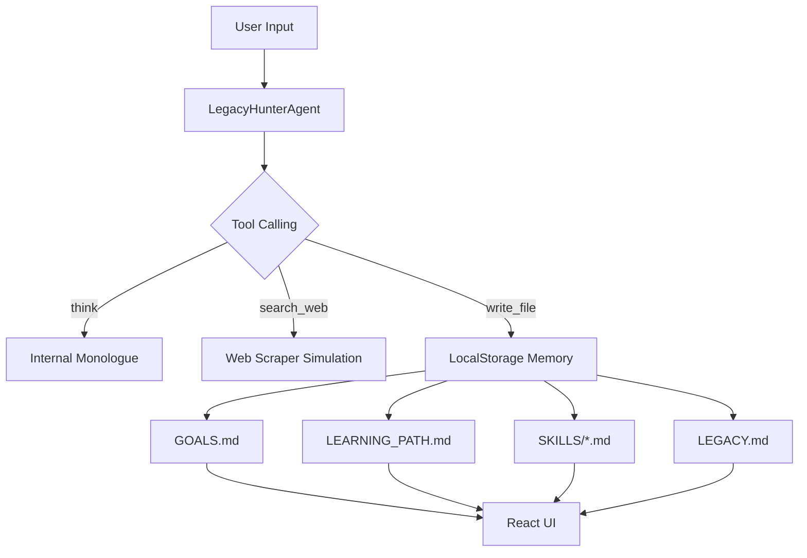

# The Legacy Hunter

**The Legacy Hunter** is an autonomous Recursive Skill Learner designed to turn your engineering career into a legendary journey. It doesn't just answer questions; it hunts for capabilities, synthesizes them into executable "Skill Programs," and builds a persistent record of your growth.

### Screenshots


## The Vision
In the age of AI, the bottleneck isn't information—it's **synthesis and verification**. The Legacy Hunter acts as your co-traveler, scouring the web for the best tech docs, boiling them down into AI-optimized tutorials, and challenging you to verify them through practical "Test Tasks."

## Tech Stack
- **Frontend:** React 19 + Vite
- **Styling:** Tailwind CSS 4 (Utility-first, high-performance)
- **AI Engine:** [Featherless.ai](https://featherless.ai/register?referrer=2EYBGPC3) (Running `Qwen/Qwen2.5-72B-Instruct`)
- **Animations:** Motion (formerly Framer Motion)
- **Icons:** Lucide React
- **Markdown:** React-Markdown + Remark-GFM

## Architecture
The application is built as a highly responsive SPA (Single Page Application) with an agent-centric logic layer.

### The Agent Loop (Recursive Reasoning)
1. **Scan:** The agent reads your `GOALS.md` to identify the next priority.
2. **Hunt:** Uses tool-calling to simulate web searches and documentation scraping.
3. **Recursive Execution:** The agent handles tool calls (think, search, write, read) in a loop (up to 10 iterations) to synthesize a complete "Skill Program" before responding.
4. **Smart Fallback:** A built-in JSON parser catches and executes tool calls even if the model outputs them as raw JSON in the content field.
5. **Verify:** Prompts the user with a "Test Task" and waits for manual verification in the UI.
6. **Log:** Updates `LEARNING_PATH.md` with a viral-style post and `LEGACY.md` with a trophy entry.



## Installation & Setup

1. **Clone the repo:**
   ```bash
   git clone https://github.com/harishkotra/legacy-hunter.git
   cd legacy-hunter
   ```

2. **Install dependencies:**
   ```bash
   npm install
   ```

3. **Configure Environment:**
   Create a `.env` file and add your Featherless API Key:
   ```env
   FEATHERLESS_API_KEY=your_key_here
   ```

4. **Run Development Server:**
   ```bash
   npm run dev
   ```

## Contributing
We welcome contributions! Whether it's a bug fix, a new UI theme, or a new agent capability.

### New Feature Ideas:
- [ ] **GitHub Sync:** Automatically push your `SKILLS/` folder to a public repo.
- [ ] **Multi-Model Switching:** Let the agent choose between different Featherless models based on task complexity.
- [ ] **Audio Briefings:** Use TTS to generate a 1-minute "Daily Standup" of your learning progress.
- [ ] **Skill Graph:** A 3D visualization of how your mastered skills connect.
